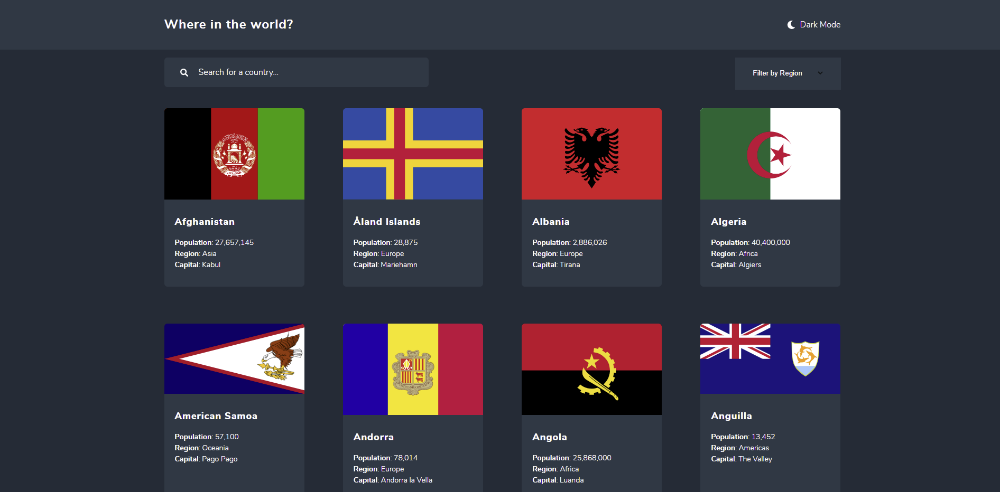

# Frontend Mentor - REST Countries API with color theme switcher solution

This is a solution to the [REST Countries API with color theme switcher challenge on Frontend Mentor](https://www.frontendmentor.io/challenges/rest-countries-api-with-color-theme-switcher-5cacc469fec04111f7b848ca). Frontend Mentor challenges help you improve your coding skills by building realistic projects.

## Table of contents

- [Frontend Mentor - REST Countries API with color theme switcher solution](#frontend-mentor---rest-countries-api-with-color-theme-switcher-solution)
  - [Table of contents](#table-of-contents)
  - [Overview](#overview)
    - [The challenge](#the-challenge)
    - [Screenshot](#screenshot)
    - [Links](#links)
  - [My process](#my-process)
    - [React](#react)
    - [SCSS](#scss)
  - [Author](#author)

**Note: Delete this note and update the table of contents based on what sections you keep.**

## Overview

### The challenge

Users should be able to:

- [x] See all countries from the API on the homepage
- [x] Search for a country using an `input` field
- [x] Filter countries by region
- [x] Click on a country to see more detailed information on a separate page
- [x] Click through to the border countries on the detail page
- [x] Toggle the color scheme between light and dark mode _(optional)_

### Screenshot



### Links

- Solution URL: [Link](https://github.com/MarcoCarpo/REST-Countries-API-Frontend-Mentor-Challange)
- Live Site URL: [Link](https://rest-country-api-with-theme-frontend-challenge.netlify.app/)

## My process

### React

- To implement the app I used the React.js library.
- React Router was used to create three routes: the home with all countries, the page with the single country, while al the other routes point to an error page.
- In context.js I created a global context to make all states and functions available globally, in order to avoid prop drilling.
- To change states I used a reducer function by using useReducer.

### SCSS

For the styling I used the sass pre-processor. The scss folder has the following structure:

```
.
|── 1-base
│ ├── _1-Variables.scss
│ ├── _2-fonts.scss
│ ├── _3-mixins.scss
│ ├── _4-reset.scss
│ └── _base-index.scss
├── 2-containers
│ ├── _app.scss
│ ├── _containers-index.scss
│ ├── _error.scss
│ └── _home.scss
├── 3-components
│ ├── _components-index.scss
│ ├── _country-item.scss
│ ├── _country.scss
│ ├── _header.scss
│ ├── _loading-spinner.scss
│ └── _search.scss
└── style.scss
```

## Author

- Website - [marcocarpona.com](https://marcocarpona.com)
- Frontend Mentor - [@MarcoCarpo](https://www.frontendmentor.io/profile/MarcoCarpo)
- Twitter - [@marcocarpona](https://twitter.com/marcocarpona)


